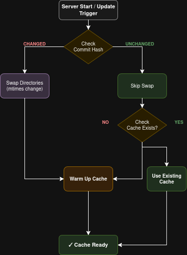

# ORD Provider Server - Caching Architecture

## Memory Cache

**Hash-Keyed Maps**:

- `documentCache` - Individual ORD documents
- `configCache` - ORD configurations
- `dirDocumentPathsCache` - Directory to document paths mapping
- `fqnMapCache` - FQN (Fully Qualified Name) maps

**Hash Calculation**: SHA-256(file paths + mtimes)

**Invalidated**: When directory hash changes (file modifications detected)

**Purpose**: Serve requests instantly without parsing/processing documents when content hasn't changed.

---

## Cache Flow



### Update Trigger Flow

1. **Server Start / Update & Webhook Trigger**
2. **Check Commit Hash**
   - **CHANGED** → Swap Directories (mtimes change) → Warm Up Cache
   - **UNCHANGED** → Skip Swap → Check Cache Exists?
     - **YES** → Use Existing Cache
     - **NO** → Warm Up Cache
3. **Cache Ready** ✓

### Smart Skip Optimization

When the commit hash is unchanged:

- **Skip swap**: No directory operations needed
- **Preserves mtimes**: Files remain untouched
- **Hash unchanged**: Memory cache remains valid
- **Result**: Fast path

---

## Cache Warming Process

### Triggers

- Server startup (if content exists)
- After git pull/clone (if commit changed)
- Webhook received
- **Skipped** if commit unchanged

### Process

1. Calculate hash: SHA-256(paths + mtimes)
2. Check if already cached for this hash
3. If not cached: Process all ORD documents
4. Build: config, documents, FQN map
5. Store in memory with hash key

### UI Status

- **Badge**: 'IN PROGRESS'
- **Hint**: 'Warming cache...'

### Cancellation

- **Cancelled on**: Manual trigger, Webhook
- **Uses**: AbortController
- **Checks**: Every 10 documents for abort signal
- **Fallback**: Falls back to inline loading if cancelled

---

## Request Handling

### Incoming Request Flow

When a request arrives at `/.well-known/open-resource-discovery` or `/ord/v1/documents/<document-name>`:

1. **Calculate current directory hash**
2. **Check if cached for this hash**
   - ✓ **YES** → Return from cache
   - ✗ **NO** → Check if warming in progress
     - **Same hash warming?** → Wait → Retry
     - **Different/no warming?** → Load inline
3. **Always served eventually**

### Waiting Logic

- **Middleware**: `waitForReady()`
- **Blocks until**: `updateInProgress = false`
- **Cache warming sets**: `updateInProgress = true`
- **Emits**: `'update-completed'` event when done
- **Timeout**: 5 minutes

### Fallback Strategy

- If warming cancelled → inline load
- If warming failed → inline load
- **Inline load**: Same process, on-demand
- **Guarantee**: Request never hangs

---

## Cache Invalidation Rules

**When**:

- Directory hash changes
- File mtimes change

**Action**: `clearCache()`

### Both Caches Preserved

**When**:

- Commit unchanged
- No directory swap

**Result**: Instant reuse

---

## Update Trigger Scenarios

### Scheduled (Every 2h)

- Check `directoryTreeSha`
- Auto-trigger if changed
- Uses incremental git pull

### Webhook (GitHub Push)

- Cancels cache warming
- Cooldown throttling (30s)
- Immediate update trigger

### Manual (API/UI Button)

- Cancels cache warming
- No cooldown
- Immediate processing

### Common Flow

All triggers use the same flow:

```
Git pull → Validate → Compare commit hash →
If changed: Swap + Warm | If same: Skip
```

---

## Hash Calculation

### SHA-256 Hash Formula

```
hash = SHA-256(
  file1_path + file1_mtime +
  file2_path + file2_mtime +
  ...
  fileN_path + fileN_mtime
)
```

### Examples

- ✓ **Same files, same mtimes** → Same hash → Cache HIT
- ✗ **Swapped directory** → New mtimes → New hash → Cache MISS
- ✓ **No swap** → Same mtimes → Same hash → Cache HIT

---

## State Transitions

```
idle → in_progress
(Git pull/clone started)

in_progress → cache_warming
(Git complete, warming started)

cache_warming → idle
(Warming complete, emits 'update-completed')

* → idle
(Skip path: commit unchanged)
```

---

## Related Diagrams

For visual representation of these flows, see:

- `ProviderServerCaching.png`
